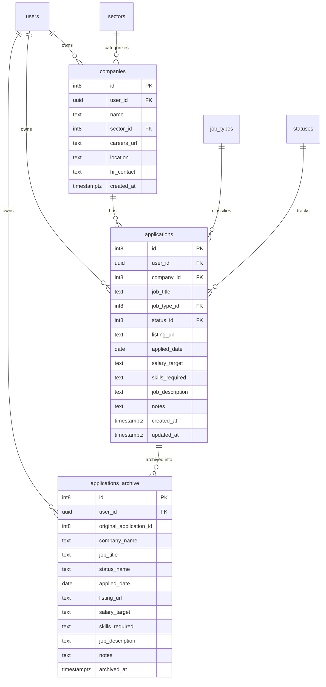

# 🚀 Job Tracker — Minimalist Application Pipeline

<div align="center">


**A high-performance, keyboard-friendly Single-Page Application (SPA) designed for software engineers and tech professionals to track applications, stages, and offers with zero fluff.**

[](https://vitejs.dev/)
[](https://tailwindcss.com/)
[](https://supabase.com/)
[](https://resend.com/)
[](https://developer.mozilla.org/)
[](#license)

[Features](#-key-features) • [Architecture & Schema](#-database-architecture--sql-schema) • [Quick Start](#-getting-started) • [Deployment](#-deployment)

</div>

---

## 🌟 Key Features

### 🔐 1. 2-Step OTP Authentication & Account Isolation
- **Bot-Proof 2-Step OTP Flow**:
  - Step 1: User enters email and password to register.
  - Step 2: Supabase / Resend delivers a numeric verification code (supports 6 to 8+ digits).
  - Auto-submits on the 8th digit with inline error handling and a "Resend code" option.
- **Postgres Row Level Security (RLS)**:
  - All database queries are automatically scoped to the logged-in user via `user_id = auth.uid()`, guaranteeing absolute data privacy and isolation.
- **Interactive Demo Mode**:
  - Test the entire application and pipeline workflows without live Supabase credentials using the built-in demo account (`demo@jobtracker.io`).

### 🎯 2. Follow-Up Radar
- Automatically analyzes active applications on the **Overview** dashboard.
- Highlights stale applications requiring candidate attention (e.g. applications with no status changes after 7+ days or upcoming interview stages).
- Provides instant jump shortcuts to follow up with recruiters.

### 📋 3. Wide-Canvas Intake & Job Spec Preservation
- **Detailed Form**: Track company, role title, job type, status, salary target, date applied, and listing URL.
- **Key Skills & Tech Stack**: Store comma-separated skills tags (e.g., `Python, FastAPI, React, PostgreSQL`).
- **Job Description Archive**: Monospace expandable textarea allowing you to paste and save the entire job description and qualifications for permanent offline reference.
- **On-the-Fly Company Creation**: Create new company profiles directly from the intake form without losing your draft.

### 🔍 4. Slide-Over "View Spec" Drawer
- Inspect complete application specifications at any time by clicking the role name or the **"Spec"** button.
- Displays:
  - Role, Company, Location, and Status Badge.
  - Metadata Grid: Job type, salary expectation, application date, and dynamic relative update time (`just now`, `2d ago`).
  - Key Skills rendered as interactive tag pills.
  - Formatted Job Description with a one-click **"Copy"** button to copy specs to your clipboard.
  - Notes & Timeline history.
- Available across both **Active** and **Archived** applications.

### ⚡ 5. Reactive Inline Status Auto-Save
- Update application stages directly inside table rows or mobile cards using interactive badge dropdowns.
- Changes update asynchronously in Supabase with instant optimistic UI reflection and micro-toast confirmations.
- Automatically refreshes status badge colors and the dynamic relative timestamp (`updated_at`).

### 🗂️ 6. Split Pipeline & Advanced Search
- **Active vs. Archive**: Toggle seamlessly between your active pipeline and historical archived applications.
- **Instant Search & Multi-Filter**: Filter applications in real time by company name, role, or specific stage (Applied, Screening, Interviewing, Offer Received, Rejected, Withdrawn).
- **Responsive Dual Layout**: Dense, high-information table on desktop; touch-friendly stacked cards on mobile (< 768px).

### 🎨 7. Linear / Raycast Graphite Design Language
- Modern, dark-first graphite aesthetic (`bg-zinc-950`, `border-zinc-800`, `text-zinc-100`).
- **Theme Switcher**: Seamlessly switch between **Dark**, **Light**, and **System Default** themes (persisted in `localStorage`).
- **Conditional Branding**: The creator tag `"by NearXkie"` subtly displays during the initial session load and fades out once navigating tabs.
- **Live Connection Monitor**: Real-time Supabase connection indicator and latency tooltip in the header.

---

## 📐 Database Architecture & SQL Schema

The database is built on PostgreSQL with Supabase Row Level Security (RLS) enforcing multi-tenant isolation per user.



### Supabase SQL Migration Script

Run this script in the **Supabase SQL Editor** to initialize the database:

```sql
-- 1. Create Sectors Table (Global Catalog)
create table if not exists sectors (
  id bigint primary key generated always as identity,
  name text not null
);

-- 2. Create Job Types Table (Global Catalog)
create table if not exists job_types (
  id bigint primary key generated always as identity,
  name text not null
);

-- 3. Create Statuses Table (Global Catalog)
create table if not exists statuses (
  id bigint primary key generated always as identity,
  name text not null,
  badge_color text
);

-- 4. Create Companies Table (User Isolated)
create table if not exists companies (
  id bigint primary key generated always as identity,
  user_id uuid default auth.uid(),
  name text not null,
  sector_id bigint references sectors(id) on delete set null,
  careers_url text,
  location text,
  hr_contact text,
  created_at timestamptz default now()
);

-- 5. Create Applications Table (User Isolated)
create table if not exists applications (
  id bigint primary key generated always as identity,
  user_id uuid default auth.uid(),
  company_id bigint not null references companies(id) on delete cascade,
  job_title text not null,
  job_type_id bigint references job_types(id) on delete set null,
  status_id bigint references statuses(id) on delete set null,
  listing_url text,
  applied_date date not null default current_date,
  salary_target text,
  skills_required text,
  job_description text,
  notes text,
  created_at timestamptz default now(),
  updated_at timestamptz default now()
);

-- 6. Create Applications Archive Table (User Isolated)
create table if not exists applications_archive (
  id bigint primary key generated always as identity,
  user_id uuid default auth.uid(),
  original_application_id bigint,
  company_name text not null,
  job_title text not null,
  status_name text,
  applied_date date,
  listing_url text,
  salary_target text,
  skills_required text,
  job_description text,
  notes text,
  archived_at timestamptz default now()
);

-- 7. Trigger to auto-update updated_at on applications
create or replace function update_updated_at_column()
returns trigger as $$
begin
  new.updated_at = now();
  return new;
end;
$$ language plpgsql;

drop trigger if exists set_applications_updated_at on applications;
create trigger set_applications_updated_at
before update on applications
for each row execute function update_updated_at_column();

-- 8. Enable Row Level Security (RLS)
alter table sectors enable row level security;
alter table job_types enable row level security;
alter table statuses enable row level security;
alter table companies enable row level security;
alter table applications enable row level security;
alter table applications_archive enable row level security;

-- Public read for lookup catalogs
create policy "Public read sectors" on sectors for select using (true);
create policy "Public read job_types" on job_types for select using (true);
create policy "Public read statuses" on statuses for select using (true);

-- User-isolated policies for private application data
create policy "User isolate companies" on companies
  for all using (auth.uid() = user_id) with check (auth.uid() = user_id);

create policy "User isolate applications" on applications
  for all using (auth.uid() = user_id) with check (auth.uid() = user_id);

create policy "User isolate applications_archive" on applications_archive
  for all using (auth.uid() = user_id) with check (auth.uid() = user_id);

-- 9. Seed Catalog Data
insert into sectors (name) values
  ('Technology & Software'),
  ('Fintech & Banking'),
  ('Healthcare & Biotech'),
  ('E-commerce & Retail'),
  ('Consulting & Professional Services')
on conflict do nothing;

insert into job_types (name) values
  ('Full-time'),
  ('Contract'),
  ('Part-time'),
  ('Internship'),
  ('Remote / Freelance')
on conflict do nothing;

insert into statuses (name, badge_color) values
  ('Applied', 'blue'),
  ('Screening / Assessment', 'yellow'),
  ('Interviewing', 'purple'),
  ('Offer Received', 'green'),
  ('Rejected', 'red'),
  ('Withdrawn', 'gray')
on conflict do nothing;
```

---

## 🛠️ Getting Started

### 1. Clone & Install Dependencies
```bash
git clone https://github.com/NearXkie/job-tracker.git
cd job-tracker
npm install
```

### 2. Configure Environment Variables
Create a `.env` file in the root directory:
```bash
cp .env.example .env
```

Add your Supabase project credentials:
```env
VITE_SUPABASE_URL=https://your-project-id.supabase.co
VITE_SUPABASE_ANON_KEY=your-actual-anon-key
```

> **Note**: If `.env` is omitted or contains placeholder values, Job Tracker automatically activates **Interactive Demo Mode** with local persistence.

### 3. Run Development Server
```bash
npm run dev
```
Open your browser at `http://localhost:5173/job-tracker/`.

### 4. Build for Production
```bash
npm run build
```
The optimized production bundle will be generated in `dist/`.

---

## 🚢 Deployment

### Automated GitHub Pages Deployment
The repository includes an automated GitHub Actions deployment workflow in `.github/workflows/deploy.yml`.

1. In your GitHub repository settings, go to **Settings > Pages**.
2. Under **Build and deployment > Source**, select **GitHub Actions**.
3. Any push to `main` will automatically build the app and deploy it to GitHub Pages.

---

## 📂 Project Structure

```
job-tracker/
├── .github/
│   └── workflows/
│       └── deploy.yml        # GitHub Actions automated deployment workflow
├── public/
│   ├── 404.html              # GitHub Pages SPA fallback
│   └── assets/
│       └── jobbase-hero.jpg  # App hero banner
├── src/
│   ├── main.js               # Application state controller, OTP flow & UI rendering
│   ├── style.css             # Tailwind base & minimalist glass styling
│   └── supabase.js           # Supabase client, queries, OTP auth & mock store
├── .env                      # Local environment variables (git-ignored)
├── .env.example              # Environment variables template
├── .gitignore                # Git ignore configuration
├── index.html                # Single-page application HTML5 layout
├── package.json              # Dependencies and build scripts
├── tailwind.config.js        # Tailwind styling configuration
├── vite.config.js            # Vite configuration with base path
└── README.md                 # Project documentation
```

---

## 📄 License
MIT License © 2026 NearXkie. Built for ambitious builders and job seekers.