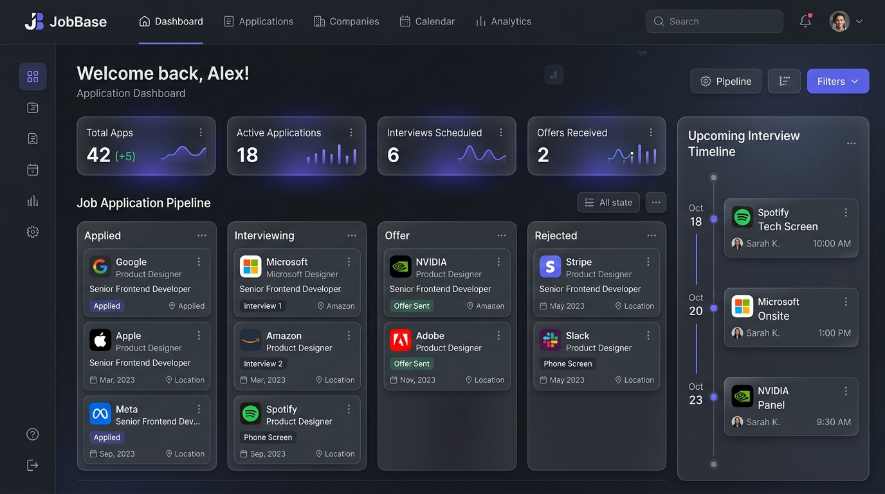
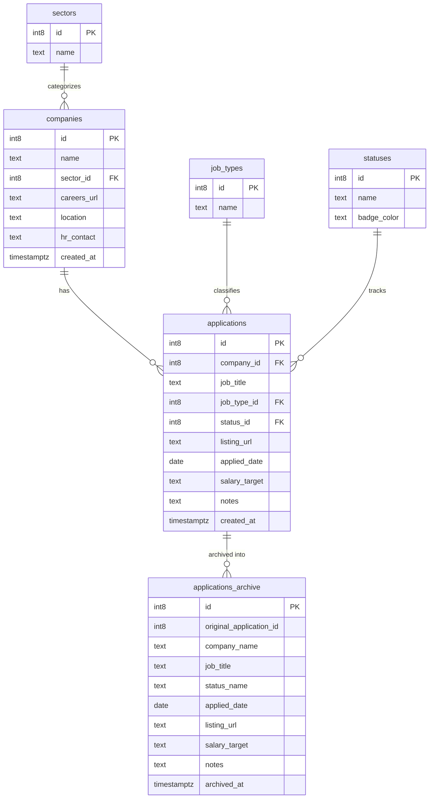

# 🚀 Job Tracker — Intelligent Job Application Pipeline

<div align="center">



**A high-performance, mobile-first Single-Page Application (SPA) designed for modern software engineers, tech professionals, and job seekers to effortlessly track, manage, and close career opportunities.**

[](https://vitejs.dev/)
[](https://tailwindcss.com/)
[](https://supabase.com/)
[](https://developer.mozilla.org/)
[](#)

[Features](#-key-features) • [Database Architecture](#-database-architecture) • [Getting Started](#-getting-started) • [Supabase Setup](#-supabase-sql-schema) • [Deployment](#-deployment)

</div>

---

## 🌟 Key Features

### 🗂️ 1. Tabbed 3-View Architecture (Single Page Routing)
- **Overview (Dashboard)**:
  - 4 Key Metric Cards (Active Applications, In Interview, Offers Received, Archived Total).
  - Quick-action jump cards: "Log an Application" and "Review Active Pipeline".
  - Recent pipeline activity preview.
- **New Application (Focused Intake)**:
  - Standalone, focused form with dynamic company, job type, and status lookups.
  - Inline **`+ New`** button to create companies on-the-fly and auto-select them without page reloads.
  - Simplified **Salary** input (no placeholder text).
  - Sleek floppy-disk save icon button with animated loading state and non-blocking toast notifications.
- **Applied (Pipeline & Tracker)**:
  - Segmented control to seamlessly toggle between **Active Pipeline** and **Archived**.
  - Search by company/role and filter by application status.
  - Desktop data table and mobile stacked card view (< 768px) with 48px touch targets.

### ⚡ 2. Frictionless Inline Status Auto-Save
- Direct status modification right inside the table or mobile card via dynamic badge dropdowns.
- Changes trigger immediate asynchronous updates to Supabase (`applications.status_id`), with instant optimistic UI reflection and micro-toast confirmations.
- Full support for the database `updated_at` trigger column, visible in row tooltips and timestamps.

### 🎨 3. Minimal Header, Theme Toggle & Conditional Branding
- **Conditional Creator Tag**: Displays `"by NearXkie"` exclusively on the initial landing view ("Overview") during the first session load. As soon as the user navigates away or switches tabs, it smoothly fades out and permanently simplifies to `"Job Tracker"`.
- **Theme Toggle**: Switch between **Dark**, **Light**, and **System Default** modes using Tailwind's `dark:` classes, persisting preference in `localStorage`.
- **Minimal Connection Indicator**: Sleek pulsing dot and info icon with hover tooltip showing real-time Supabase connection status and latency.

### 🗄️ 3. Atomic Application Archiving
- Archive completed or historic applications with one click.
- Preserves full application history in `applications_archive` (including company name, role, final status, salary target, and notes) and purges the active record.
- Dedicated **Archive View** with permanent deletion logs.

### 🛡️ 4. Connection Resilience & Demo Mode
- **Live Supabase Health Indicator**: Checks database connectivity on page load and reflects live status in the header badge.
- **Zero-Crash Demo Mode**: If credentials in `.env` are placeholders or not yet configured, JobBase automatically engages an interactive simulation with local persistence so the UI and workflows can be previewed immediately.

### 🔍 5. Real-Time Search & Filtering
- Instant, non-blocking client-side search across company names and job titles.
- Multi-status filter to focus on high-priority stages (e.g., "In Interview", "Offers Received").

### 📱 6. Production & SEO Ready
- OpenGraph metadata, theme color, responsive viewport, and Google Font (`Inter`) integration.
- Dynamic document titles updating based on view (`Active Pipeline | JobBase`, `Archive | JobBase`).
- Includes GitHub Pages SPA fallback (`public/404.html`).

---

## 📐 Database Architecture

The data model follows a relational architecture designed for PostgreSQL in Supabase.



---

## 🗃️ Supabase SQL Schema

To set up your Supabase project, execute the following SQL in your **Supabase SQL Editor**:

```sql
-- 1. Create Sectors Table
create table if not exists sectors (
  id bigint primary key generated always as identity,
  name text not null
);

-- 2. Create Job Types Table
create table if not exists job_types (
  id bigint primary key generated always as identity,
  name text not null
);

-- 3. Create Statuses Table
create table if not exists statuses (
  id bigint primary key generated always as identity,
  name text not null,
  badge_color text
);

-- 4. Create Companies Table
create table if not exists companies (
  id bigint primary key generated always as identity,
  name text not null,
  sector_id bigint references sectors(id) on delete set null,
  careers_url text,
  location text,
  hr_contact text,
  created_at timestamptz default now()
);

-- 5. Create Applications Table
create table if not exists applications (
  id bigint primary key generated always as identity,
  company_id bigint not null references companies(id) on delete cascade,
  job_title text not null,
  job_type_id bigint references job_types(id) on delete set null,
  status_id bigint references statuses(id) on delete set null,
  listing_url text,
  applied_date date not null default current_date,
  salary_target text,
  notes text,
  created_at timestamptz default now()
);

-- 6. Create Applications Archive Table
create table if not exists applications_archive (
  id bigint primary key generated always as identity,
  original_application_id bigint,
  company_name text not null,
  job_title text not null,
  status_name text,
  applied_date date,
  listing_url text,
  salary_target text,
  notes text,
  archived_at timestamptz default now()
);

-- Enable Row Level Security (RLS) with Public Access
alter table sectors enable row level security;
alter table job_types enable row level security;
alter table statuses enable row level security;
alter table companies enable row level security;
alter table applications enable row level security;
alter table applications_archive enable row level security;

create policy "Public read/write sectors" on sectors for all using (true) with check (true);
create policy "Public read/write job_types" on job_types for all using (true) with check (true);
create policy "Public read/write statuses" on statuses for all using (true) with check (true);
create policy "Public read/write companies" on companies for all using (true) with check (true);
create policy "Public read/write applications" on applications for all using (true) with check (true);
create policy "Public read/write applications_archive" on applications_archive for all using (true) with check (true);

-- Initial Seed Data
insert into sectors (name) values
  ('Technology & Software'),
  ('Fintech & Banking'),
  ('Healthcare & Biotech'),
  ('E-commerce & Retail'),
  ('Consulting & Professional Services');

insert into job_types (name) values
  ('Full-time'),
  ('Contract'),
  ('Part-time'),
  ('Internship'),
  ('Remote / Freelance');

insert into statuses (name, badge_color) values
  ('Applied', 'blue'),
  ('Screening / Assessment', 'yellow'),
  ('Interviewing', 'purple'),
  ('Offer Received', 'green'),
  ('Rejected', 'red'),
  ('Withdrawn', 'gray');
```

---

## 🛠️ Getting Started

### 1. Clone & Install Dependencies
```bash
git clone <your-repo-url>
cd job-tracker
npm install
```

### 2. Configure Environment Variables
Create a `.env` file in the project root (or copy `.env.example`):
```bash
cp .env.example .env
```

Set your Supabase credentials:
```env
VITE_SUPABASE_URL=https://your-project-id.supabase.co
VITE_SUPABASE_ANON_KEY=your-supabase-anon-key
```

### 3. Start Development Server
```bash
npm run dev
```
Open your browser at `http://localhost:5173`.

### 4. Build for Production
```bash
npm run build
```
The optimized bundle will be created in the `dist/` directory.

---

## 🚢 Deployment

### Deploying to GitHub Pages
1. Ensure `public/404.html` is present (already configured in this repository).
2. Configure your GitHub Actions workflow or run:
   ```bash
   npm run build
   # Push dist directory to gh-pages branch
   ```

### Deploying to Vercel or Netlify
1. Connect your Git repository.
2. Build command: `npm run build`
3. Output directory: `dist`
4. Configure environment variables (`VITE_SUPABASE_URL`, `VITE_SUPABASE_ANON_KEY`) in the provider dashboard.

---

## 📂 Project Structure

```
job-tracker/
├── .env                      # Environment configuration
├── .env.example              # Template environment variables
├── .gitignore                # Ignored paths (node_modules, dist, .env)
├── index.html                # Main SPA markup & layout
├── package.json              # Project dependencies & scripts
├── postcss.config.js         # PostCSS configuration
├── tailwind.config.js        # Tailwind CSS theme & plugin config
├── vite.config.js            # Vite bundler configuration
├── schema.png                # Supabase ERD diagram
├── public/
│   ├── 404.html              # GitHub Pages SPA fallback
│   └── assets/
│       └── jobbase-hero.jpg  # Generated hero banner
├── src/
│   ├── main.js               # Application logic, state, and DOM controller
│   ├── style.css             # Tailwind base styles and glassmorphic utilities
│   └── supabase.js           # Supabase client, queries, and fallback store
└── readme.md                 # Complete project documentation
```

---

## 📄 License
MIT License © 2026 JobBase. Designed for ambitious professionals.